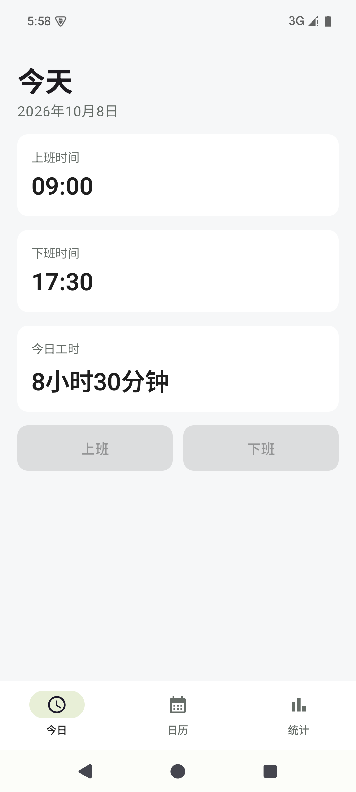
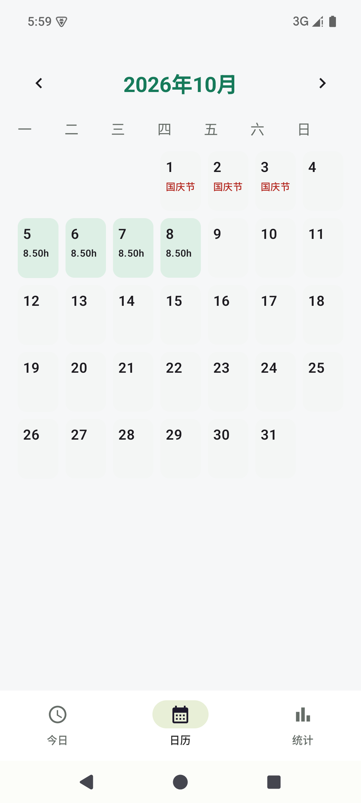
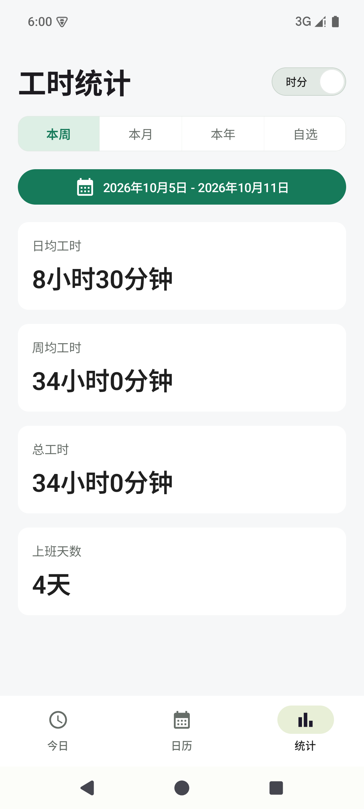

# 工时打卡 · WorkPunch

一款中文、离线使用的 Android 工时记录工具，支持 Android 8.0 及以上。
本仓库只包含 Android 源码，不包含 iOS 工程。

## 界面预览

| 今日打卡 | 历史日历 | 工时统计 |
| :---: | :---: | :---: |
|  |  |  |

截图来自 Android 模拟器，使用演示数据，不包含真实个人记录。

## 下载体验

前往 [GitHub Releases](https://github.com/794323756/workpunch-android/releases)
下载 APK，传到 Android 手机后打开，按系统提示允许安装该来源的应用。
当前提供的是调试签名的测试版；覆盖安装前请核对签名，不要为升级而直接卸载已有应用，
避免丢失打卡数据。

## 功能

- 上班、下班一键打卡，重复点击不会覆盖已有打卡时间。
- 桌面小组件，绿色表示可打卡，灰色表示不可用。
- 月历浏览历史记录，支持左右滑动切换月份和滚轮选择年月。
- 从日期详情添加、编辑或删除打卡记录。
- 本周、本月、本年及自选日期范围的工时统计。
- 时分与十进制小时切换，例如 11 小时 30 分钟 = 11.50 小时。
- 显示上班天数及中国节日标注。

## 本地构建

环境要求：

- Android Studio，或 JDK 17 与 Android SDK 命令行工具。
- Android SDK Platform 35；首次构建需要联网下载依赖。
- Gradle Wrapper 已随源码提供，无需另外安装 Gradle。

Android Studio：打开仓库目录，等待 Gradle 同步完成，然后构建 `app` 模块。

命令行：设置 `ANDROID_HOME` 指向本机 Android SDK；也可在未提交的
`local.properties` 中设置 `sdk.dir`。

```sh
./gradlew testDebugUnitTest assembleDebug
```

Windows 使用 `gradlew.bat testDebugUnitTest assembleDebug`。

生成的测试安装包位于：

```text
app/build/outputs/apk/debug/app-debug.apk
```

将 APK 传到 Android 手机，打开并按系统提示允许安装该来源的应用。
长按桌面空白区域，从小组件列表添加“工时打卡”。

## 工时计算

- 完整工时按下班时间减去上班时间计算，不自动扣除午休或其他休息时间。
- 当天已上班但未下班时，今日页显示截至当前时间的工时；统计仅纳入完整记录。
- 日均工时 = 完整记录的总工时 / 完整记录天数。
- “本年”的年均工时表示所选年度内完整记录的日均工时。
- 周均工时 = 总工时 / 所选范围覆盖的自然周数；一周从周一开始。
- 上班天数按有上班记录的日期计数；未打下班卡的日期也计入。
- 时长计算以整分钟为单位，十进制小时显示保留两位小数。

## 数据与限制

打卡数据保存在手机本地的 Room 数据库中。应用没有网络权限，不使用账号、
广告或分析服务。Android 系统备份已启用，因此操作系统可能根据用户的备份设置
备份应用数据；这与应用自行上传数据不同。

卸载或清除应用数据可能丢失记录，当前没有应用内导出或跨设备同步功能。
节日标注按公历与农历规则计算，不包含每年完整的调休、补班和连休安排。
本工具用于个人记录，不作为单位考勤或工资核算的权威依据。

## 发布与升级

测试包使用开发环境的调试签名。正式发布应在 Android Studio 中生成签名 APK，
私钥和密码保存在仓库外。后续版本使用相同签名，并递增 `versionCode`，才能覆盖安装。
不同开发环境的调试签名可能不同，不保证可以覆盖已有安装。

安装包适合通过 GitHub Releases 分发，源码仓库不跟踪 APK 或构建产物。

## 技术栈

Kotlin、Jetpack Compose / Material 3、Room、Android AppWidget。

## 贡献与许可

欢迎提交问题和改进建议。提交修改前运行现有单元测试，并检查打卡、日历、
统计与小组件的状态是否一致。

源码采用 [MIT License](LICENSE)。图标等视觉素材的授权另见 [素材说明](ASSETS.md)。
第三方依赖遵循各自许可证，见 [依赖说明](THIRD_PARTY.md)。
